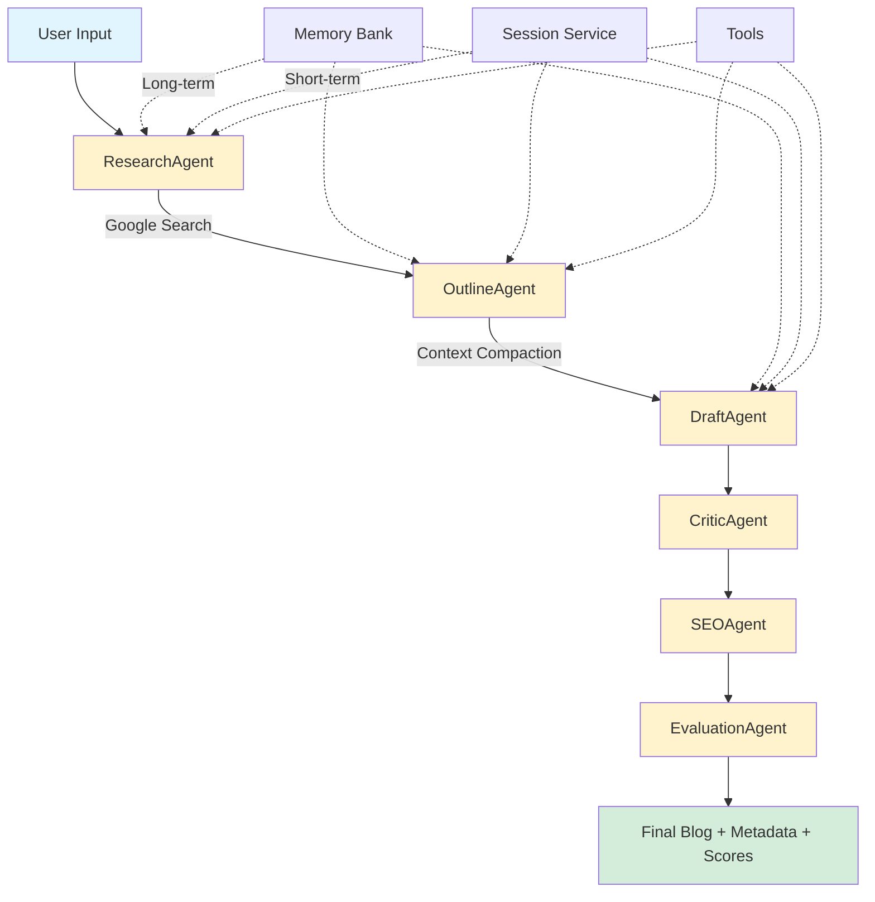

# 🧠✍️ AI Blog Production Agent

<div align="center">


**A production-grade multi-agent content creation system powered by Google ADK and Gemini 2.5**

*Submitted for the Kaggle 5-Day AI Agents Intensive – Capstone Project (2025)*

[Features](#-features) • [Architecture](#-architecture) • [Installation](#-installation) • [Usage](#-usage)

</div>

---

## 📖 Table of Contents

- [Overview](#-overview)
- [Features](#-features)
- [Architecture](#-architecture)
- [Multi-Agent Workflow](#-multi-agent-workflow)
- [Tools & Capabilities](#-tools--capabilities)
- [Installation](#-installation)
- [Usage](#-usage)
  - [Web UI (Streamlit)](#-option-1-streamlit-web-app-recommended)
  - [CLI Mode](#-option-2-cli-mode)
- [Project Structure](#-project-structure)
- [Configuration](#-configuration)
- [Memory & Context Management](#-memory--context-management)
- [Observability](#-observability)
- [Agent Evaluation](#-agent-evaluation)
- [Kaggle Capstone Requirements](#-kaggle-capstone-requirements)
- [Examples](#-examples)
- [Troubleshooting](#-troubleshooting)
- [Contributing](#-contributing)
- [License](#-license)

---

## 🌟 Overview

The **AI Blog Production Agent** is an end-to-end autonomous content creation system that transforms a simple topic into a fully optimized, research-backed blog article. Built with **Google ADK** and **Gemini 2.5**, this multi-agent system eliminates hours of manual research, writing, and optimization.

### Why This Project?

Modern content creators face a time-consuming workflow:
- ⏰ Hours of research and fact-checking
- 📝 Multiple drafts and revisions
- 🔍 SEO optimization and metadata generation
- 📊 Quality evaluation and proofreading

**Our Solution:** A coordinated team of specialized AI agents that autonomously handle each step, producing publication-ready content in seconds.

---

## ✨ Features

### 🎯 Core Capabilities

| Feature | Description |
|---------|-------------|
| **6-Agent Workflow** | Specialized agents for research, outlining, drafting, critique, SEO, and evaluation |
| **Grounded Research** | Real-time Google Search integration for factual accuracy |
| **Custom Tools** | Code execution, user profiling, and search capabilities |
| **Memory Systems** | Both short-term (session) and long-term (persistent) memory |
| **Context Management** | Intelligent token optimization and compaction |
| **SEO Optimization** | Auto-generated titles, meta descriptions, keywords, and social captions |
| **Quality Evaluation** | LLM-powered scoring across clarity, structure, SEO, and usefulness |
| **Dual Interface** | Beautiful Streamlit web UI + functional CLI |
| **Observability** | Structured JSONL logging with metrics and tracing |

### 🎨 UI Features

- 🎭 **Typewriter Animation** - Watch your blog materialize in real-time
- 📊 **Live Console Logs** - Monitor agent pipeline execution
- 📥 **Download Options** - Export as Markdown or Text
- 📚 **History Tracking** - Access previous generations
- ⚙️ **Customizable Settings** - Tone, audience, word count, and more
- 🔍 **Agent Step Viewer** - Inspect each agent's output

---

## 🏗 Architecture



### System Components

```
┌─────────────────────────────────────────────────────────────┐
│                     User Interface Layer                     │
│                  (Streamlit Web UI / CLI)                    │
└─────────────────────────┬───────────────────────────────────┘
                          │
┌─────────────────────────▼───────────────────────────────────┐
│                    Orchestration Layer                       │
│              (Runner, Session Management)                    │
└─────────────────────────┬───────────────────────────────────┘
                          │
┌─────────────────────────▼───────────────────────────────────┐
│                      Agent Layer                             │
│  Research → Outline → Draft → Critic → SEO → Evaluation     │
└─────────────────────────┬───────────────────────────────────┘
                          │
┌─────────────────────────▼───────────────────────────────────┐
│                       Tools Layer                            │
│    Google Search | Code Execution | User Profile            │
└─────────────────────────┬───────────────────────────────────┘
                          │
┌─────────────────────────▼───────────────────────────────────┐
│                     Memory Layer                             │
│     Session Service | Memory Bank | Context Manager         │
└─────────────────────────────────────────────────────────────┘
```

---

## 🤖 Multi-Agent Workflow

### Agent Pipeline Sequence

```
Input → Research → Outline → Draft → Critic → SEO → Evaluation → Output
```

| # | Agent | Role | Output |
|---|-------|------|--------|
| **1** | 🔬 **ResearchAgent** | Gathers factual information using Google Search | Structured research notes, facts, statistics |
| **2** | 📋 **OutlineAgent** | Converts research into logical structure | Markdown outline with headings and sections |
| **3** | ✍️ **DraftAgent** | Expands outline into full content | Complete blog article draft |
| **4** | 🧐 **CriticAgent** | Improves clarity, grammar, and flow | Refined, polished article |
| **5** | 🚀 **SEOAgent** | Generates SEO metadata and optimizations | Final article + SEO metadata |
| **6** | 📊 **EvaluationAgent** | Scores quality across multiple dimensions | JSON evaluation scores |

### Agent Details

#### 1️⃣ ResearchAgent
- **Model:** Gemini 2.5 Flash
- **Tools:** Google Search Tool
- **Function:** Conducts grounded research with real-time web data
- **Output Format:** Bullet points, key facts, definitions, statistics

#### 2️⃣ OutlineAgent
- **Model:** Gemini 2.5 Flash
- **Function:** Structures research into logical flow
- **Output Format:** Hierarchical markdown with `#`, `##`, `###` headings

#### 3️⃣ DraftAgent
- **Model:** Gemini 2.5 Flash
- **Function:** Transforms outline into complete prose
- **Output Format:** Full markdown blog with examples and explanations

#### 4️⃣ CriticAgent
- **Model:** Gemini 2.5 Flash
- **Function:** Editorial review and quality improvement
- **Focuses On:** Clarity, grammar, flow, structure, conciseness

#### 5️⃣ SEOAgent
- **Model:** Gemini 2.5 Flash
- **Function:** SEO optimization and metadata generation
- **Generates:**
  - SEO-optimized title
  - Meta description
  - URL slug
  - Keyword list
  - Social media caption

#### 6️⃣ EvaluationAgent
- **Model:** Gemini 2.5 Flash
- **Function:** Objective quality assessment
- **Metrics:**
  - Clarity (1-10)
  - Structure (1-10)
  - SEO Strength (1-10)
  - Usefulness (1-10)
  - Overall Score (1-10)

---

## 🛠 Tools & Capabilities

### 1. Google Search Tool

```python
google_search(query: str) -> str
```

- **Type:** Grounded search via Gemini 2.5
- **Purpose:** Real-time web information retrieval
- **Integration:** Native Gemini `google_search` capability
- **Use Cases:** Current events, statistics, fact-checking

### 2. Code Execution Tool

```python
code_execution_tool(code: str) -> str
```

- **Type:** Sandboxed Python execution
- **Purpose:** Computational analysis and calculations
- **Allowed Operations:**
  - Readability scoring
  - Keyword density analysis
  - Word count calculations
  - Basic data processing
- **Safety:** Restricted namespace with limited built-ins

### 3. User Profile Tool

```python
user_profile_tool(
    action: Literal["get", "set", "append"],
    key: str,
    value: Optional[str] = None,
    session_id: str = "default_session"
) -> str
```

- **Type:** Persistent storage interface
- **Purpose:** User preference management
- **Stores:**
  - Writing tone preferences
  - Target audiences
  - SEO keyword history
  - Blog generation history
  - Custom writing styles

---

## 💾 Installation

### Prerequisites

- Python 3.8 or higher
- Google API Key (Gemini access)
- pip package manager

### Step 1: Clone Repository

```bash
git clone https://github.com/irkky/AI-Blog-Agent.git
cd AI-Blog-Agent
```

### Step 2: Create Virtual Environment

```bash
# Using venv
python -m venv venv

# Activate (Windows)
venv\Scripts\activate

# Activate (macOS/Linux)
source venv/bin/activate
```

### Step 3: Install Dependencies

```bash
pip install -r requirements.txt
```

### Step 4: Configure Environment

Create a `.env` file in the project root:

```env
# Required
GOOGLE_API_KEY=your_google_api_key_here

# Optional
GEMINI_MODEL_ID=gemini-2.5-flash
APP_NAME=ai_blog_agent
ENVIRONMENT=development
DEBUG_MODE=True
```

**Getting a Google API Key:**
1. Visit [Google AI Studio](https://makersuite.google.com/app/apikey)
2. Sign in with your Google account
3. Click "Create API Key"
4. Copy the key to your `.env` file

---

## 🚀 Usage

### 🌐 Option 1: Streamlit Web App (Recommended)

Launch the interactive web interface:

```bash
streamlit run streamlit_app.py
```

The app will open at `http://localhost:8501`

#### Web UI Features

**Input Panel:**
- Topic text field
- Tone selector (Professional, Casual, Technical, Beginner-friendly)
- Target audience customization
- Word count slider (600-3000)
- Extra instructions text area

**Interactive Options:**
- ⌨️ Typewriter animation toggle
- 🔍 Show agent prompts
- 📖 Auto-expand all steps

**Output Tabs:**
- 📄 **Final Blog** - Animated display of finished article
- 📦 **Downloads** - Export as `.md` or `.txt`
- 🧩 **Agent Steps** - View each agent's output
- 📟 **Console Logs** - Real-time pipeline monitoring
- 🗂 **History** - Access previous generations

### 🖥 Option 2: CLI Mode

Run via command line for programmatic access:

```bash
python main.py
```

**Interactive Prompts:**
```
Enter topic: How to build a multi-agent AI system
Tone (default Professional): Technical
Audience (default beginner developers): AI engineers
Word count (default 1500): 2000
```

The CLI will:
1. Execute the 6-agent pipeline
2. Display progress for each step
3. Output the final blog to console
4. Show evaluation scores
5. Save logs to `logs/events.jsonl`

---

## 📁 Project Structure

```
ai_blog_agent/
│
├── 📂 blog_agents/              # Agent definitions
│   ├── research_agent.py        # Grounded research agent
│   ├── outline_agent.py         # Content structure agent
│   ├── draft_agent.py           # Content writing agent
│   ├── critic_agent.py          # Editorial review agent
│   ├── seo_agent.py             # SEO optimization agent
│   └── evaluation_agent.py      # Quality scoring agent
│
├── 📂 tools/                    # Custom tool implementations
│   ├── google_search_tool.py    # Grounded search wrapper
│   ├── code_execution_tool.py   # Python execution sandbox
│   └── user_profile_tool.py     # Preference management
│
├── 📂 memory/                   # Memory systems
│   ├── memory_bank.py           # Long-term storage
│   └── session_service.py       # Short-term session data
│
├── 📂 utils/                    # Utility functions
│   └── context_manager.py       # Context compaction logic
│
├── 📂 app_logging/              # Observability
│   ├── __init__.py
│   └── logger.py                # JSONL event logger
│
├── 📂 logs/                     # Generated logs
│   └── events.jsonl             # Structured event logs
│
├── 📄 main.py                   # CLI entry point
├── 📄 streamlit_app.py          # Web UI entry point
├── 📄 config.py                 # Configuration management
├── 📄 requirements.txt          # Python dependencies
├── 📄 .env.example              # Environment template
├── 📄 .gitignore                # Git ignore rules
└── 📄 README.md                 # This file
```

---

## ⚙️ Configuration

### Environment Variables

| Variable | Required | Default | Description |
|----------|----------|---------|-------------|
| `GOOGLE_API_KEY` | ✅ Yes | - | Google Gemini API key |
| `GEMINI_MODEL_ID` | No | `gemini-2.5-flash` | Model identifier |
| `APP_NAME` | No | `AI_BLOG_AGENT` | Application name |
| `ENVIRONMENT` | No | `development` | Runtime environment |
| `DEBUG_MODE` | No | `False` | Enable debug logging |

### Model Configuration

The system uses **Gemini 2.5 Flash** by default for optimal balance of quality and speed. You can modify the model in agent definitions:

```python
from google.adk.agents import LlmAgent

agent = LlmAgent(
    name="custom_agent",
    model="gemini-2.5-pro",  # Upgrade to Pro for higher quality
    instruction="Your instructions here"
)
```

---

## 🧠 Memory & Context Management

### Two-Tier Memory System

#### 1. Short-Term Memory (Session Service)
- **Scope:** Current session only
- **Lifecycle:** Cleared when session ends
- **Storage:** In-memory dictionary
- **Use Cases:**
  - Current generation parameters
  - Agent-to-agent state passing
  - Temporary user inputs

#### 2. Long-Term Memory (Memory Bank)
- **Scope:** Persistent across sessions
- **Lifecycle:** Survives restarts
- **Storage:** Thread-safe in-memory store
- **Use Cases:**
  - User writing preferences
  - Historical blog topics
  - SEO keyword library
  - Favorite writing styles

### Context Compaction

The `context_manager.py` implements intelligent truncation to prevent token overflow:

```python
def truncate_text(text: str, max_chars: int = 8000) -> str:
    """
    Keeps 70% from start + 20% from end
    Inserts truncation marker in middle
    """
```

**Applied After:**
- ResearchAgent output (6000 chars)
- OutlineAgent output (6000 chars)
- DraftAgent output (9000 chars)
- CriticAgent output (9000 chars)

**Benefits:**
- Consistent token usage
- Preserved context quality
- Predictable costs
- Stable performance

---

## 📊 Observability

### Structured Logging

All events are logged to `logs/events.jsonl` in structured format:

```json
{
  "ts": 1704067200.123,
  "event_type": "agent_run",
  "agent": "research_agent",
  "step": "run",
  "message": "Agent completed successfully.",
  "duration_sec": 2.45,
  "extra": {
    "chars_out": 3421
  }
}
```

### Event Types

| Type | Description | Fields |
|------|-------------|--------|
| `agent_run` | Normal agent execution | duration, chars_out |
| `error` | Agent failure | error message, traceback |
| `evaluation` | Quality scoring | raw_eval JSON |

### Metrics Tracked

- ⏱ **Duration:** Execution time per agent
- 📏 **Output Length:** Character count of responses
- ✅ **Success Rate:** Completion vs errors
- 🔍 **Tool Usage:** Which tools were called
- 📊 **Quality Scores:** Evaluation metrics

### Analyzing Logs

```python
import json

with open("logs/events.jsonl") as f:
    events = [json.loads(line) for line in f]

# Average research agent duration
research_times = [
    e["duration_sec"] for e in events 
    if e["agent"] == "research_agent"
]
avg_duration = sum(research_times) / len(research_times)
print(f"Average research time: {avg_duration:.2f}s")
```

---

## 📈 Agent Evaluation

### Evaluation Dimensions

The **EvaluationAgent** scores content across five dimensions:

1. **Clarity (1-10)**
   - Writing is easy to understand
   - Concepts explained simply
   - No jargon without definitions

2. **Structure (1-10)**
   - Logical flow of ideas
   - Good use of headings
   - Smooth transitions

3. **SEO (1-10)**
   - Keyword optimization
   - Meta description quality
   - URL slug appropriateness

4. **Usefulness (1-10)**
   - Actionable advice
   - Relevant to target audience
   - Practical examples

5. **Overall (1-10)**
   - Holistic quality assessment
   - Publication readiness

### Sample Evaluation Output

```json
{
  "clarity": 9,
  "structure": 9,
  "seo": 8,
  "usefulness": 9,
  "overall": 9,
  "comments": "Well-structured and highly actionable. SEO could include more long-tail keywords."
}
```

---

## ✅ Kaggle Capstone Requirements

This project fulfills all requirements for the **Kaggle 5-Day AI Agents Intensive Capstone (Concierge Agents Track)**:

| # | Requirement | Implementation | Location |
|---|-------------|----------------|----------|
| **1** | **Multi-Agent System** | 6 specialized agents with distinct roles | `blog_agents/` |
| **2** | **Google ADK** | Built entirely on ADK Runner + LlmAgent | All agents |
| **3** | **Custom Tools** | Code execution, user profile, search | `tools/` |
| **4** | **Memory Management** | Session + long-term memory systems | `memory/` |
| **5** | **Context Engineering** | Intelligent truncation and compaction | `utils/context_manager.py` |
| **6** | **Observability** | JSONL logging with metrics | `app_logging/logger.py` |
| **7** | **Agent Evaluation** | LLM-powered quality scoring | `blog_agents/evaluation_agent.py` |
| **8** | **Production Quality** | Error handling, logging, UI | All files |

### Bonus Features

- 🌐 **Dual Interface** - Web UI + CLI
- 🔍 **Grounded Search** - Real-time Google integration
- 📦 **Export Options** - Markdown and text downloads
- 📚 **History** - Session-based generation tracking
- 🎨 **UX Polish** - Typewriter animation, live logs

---

## 💡 Examples

### Example 1: Technical Tutorial

**Input:**
- Topic: "How to implement OAuth 2.0 in Python"
- Tone: Technical
- Audience: Backend developers
- Word Count: 2000

**Output Includes:**
- Introduction to OAuth 2.0 flow
- Step-by-step implementation guide
- Code examples with Flask
- Security best practices
- Common pitfalls
- SEO title: "OAuth 2.0 Python Implementation: Complete Developer Guide"

### Example 2: Beginner-Friendly Explainer

**Input:**
- Topic: "What is machine learning"
- Tone: Beginner-friendly
- Audience: Non-technical professionals
- Word Count: 1200

**Output Includes:**
- Simple analogies and metaphors
- Real-world examples
- No complex math
- Visual descriptions
- Practical use cases
- SEO title: "Machine Learning Explained Simply: A Beginner's Guide"

### Example 3: Professional Analysis

**Input:**
- Topic: "The impact of AI on software development productivity"
- Tone: Professional
- Audience: CTOs and engineering managers
- Word Count: 1800

**Output Includes:**
- Research-backed statistics
- Industry trends
- Case studies
- ROI considerations
- Implementation strategies
- SEO title: "AI's Impact on Developer Productivity: 2024 Analysis for CTOs"

---

## 🔧 Troubleshooting

### Common Issues

#### 1. API Key Errors

```
ConfigError: Missing GOOGLE_API_KEY in environment
```

**Solution:**
- Verify `.env` file exists
- Check API key is correctly copied
- Ensure no extra spaces in key

#### 2. Import Errors

```
ModuleNotFoundError: No module named 'google.adk'
```

**Solution:**
```bash
pip install --upgrade google-adk google-genai
```

#### 3. Empty Responses

```
Error: No final response from agent
```

**Solution:**
- Check internet connection (for Google Search)
- Verify API quota not exceeded
- Try simpler topic
- Check logs at `logs/events.jsonl`

#### 4. Streamlit Port Conflicts

```
OSError: [Errno 98] Address already in use
```

**Solution:**
```bash
# Use different port
streamlit run streamlit_app.py --server.port 8502
```

### Debug Mode

Enable detailed logging:

```env
DEBUG_MODE=True
```

View logs in real-time:

```bash
tail -f logs/events.jsonl | jq .
```

---

## 🤝 Contributing

We welcome contributions! Here's how to get started:

### Development Setup

```bash
# Fork and clone
git https://github.com/irkky/AI-Blog-Agent.git
cd AI-Blog-Agent

# Create feature branch
git checkout -b feature/your-feature-name

# Install dev dependencies
pip install -r requirements.txt
```

### Contribution Areas

- 🐛 Bug fixes
- ✨ New agent types
- 🛠 Additional tools
- 📚 Documentation improvements
- 🎨 UI enhancements
- 🧪 Test coverage
- 🌍 Internationalization

### Pull Request Process

1. Update documentation
2. Add tests for new features
3. Ensure all tests pass
4. Update CHANGELOG.md
5. Submit PR with clear description

---

## 📝 License

This project is licensed under the **MIT License**.

```
MIT License

Copyright (c) 2025 irkky

Permission is hereby granted, free of charge, to any person obtaining a copy
of this software and associated documentation files (the "Software"), to deal
in the Software without restriction, including without limitation the rights
to use, copy, modify, merge, publish, distribute, sublicense, and/or sell
copies of the Software, and to permit persons to whom the Software is
furnished to do so, subject to the following conditions:

The above copyright notice and this permission notice shall be included in all
copies or substantial portions of the Software.
```

---

## 🙏 Acknowledgments

- **Google ADK Team** - For the powerful agent framework
- **Kaggle** - For hosting the AI Agents Intensive
- **Streamlit** - For the excellent web framework
- **Community Contributors** - For feedback and improvements

---

## 📧 Contact & Support

- **Issues:** [GitHub Issues](https://github.com/irkky/AI-Blog-Agent/issues)
- **Discussions:** [GitHub Discussions](https://github.com/irkky/AI-Blog-Agent/discussions)
- **Email:** rishabhkrkannaujia@gmail.com

---

<div align="center">

**Built with ❤️ using Google ADK and Gemini 2.5**

⭐ **Star this repo if you found it helpful!** ⭐

</div>