# 🧠✍️ AI Blog Agent

<div align="center">


**A production-grade multi-agent content creation system powered by Google ADK and Gemini 2.5**

*Submitted for the Kaggle 5-Day AI Agents Intensive – Capstone Project (2025)*

[Features](#-features) • [Architecture](#-architecture) • [Installation](#-installation) • [Usage](#-usage)


[](https://www.kaggle.com/code/rishabhkannaujiya/ai-blog-agent-capstone-submission-concierge)
[](https://www.youtube.com/watch?v=kQpODXEVUUI)

</div>


---

## 📖 Table of Contents

- [Overview](#-overview)
- [Features](#-features)
- [Architecture](#-architecture)
- [Multi-Agent Workflow](#-multi-agent-workflow)
- [Installation](#-installation)
- [Usage](#-usage)
  - [Web UI (Streamlit)](#-option-1-streamlit-web-app-recommended)
  - [CLI Mode](#-option-2-cli-mode)
- [Project Structure](#-project-structure)
- [Configuration](#-configuration)
- [Memory & Context Management](#-memory--context-management)
- [Observability](#-observability)
- [Agent Evaluation](#-agent-evaluation)
- [Examples](#-examples)
- [Troubleshooting](#-troubleshooting)
- [Contributing](#-contributing)
- [License](#-license)

---

## 🌟 Overview

The **AI Blog Agent** is an end-to-end autonomous content creation system that transforms a simple topic into a fully optimized, research-backed blog article. Built with **Google ADK** and **Gemini 2.5**, this multi-agent system eliminates hours of manual research, writing, and optimization.

### Why This Project?

Modern content creators face a time-consuming workflow:
- ⏰ Hours of research and fact-checking
- 📝 Multiple drafts and revisions
- 🔍 SEO optimization and metadata generation
- 📊 Quality evaluation and proofreading

**Our Solution:** A coordinated team of specialized AI agents that autonomously handle each step, producing publication-ready content in seconds.

---

## ✨ Features

### 🎯 Core Capabilities

<table style="width: 100%; border-collapse: collapse; margin: 30px 0;">
<tr>

<!-- Google ADK Implementation -->
<td style="vertical-align: top; padding: 15px; background-color: #1e1e1e; border: 1px solid #333; border-left: 4px solid #2196f3; color: white; border-radius: 8px;">
  <h3 style="margin-top: 0; color: #64b5f6;">🏗️ Google ADK Implementation</h3>
  <p>Built entirely on <code>google-adk</code> library using:</p>
  <ul>
    <li><code>Runner</code> for orchestration</li>
    <li><code>LlmAgent</code> for agent definitions</li>
    <li><code>InMemorySessionService</code> for state management</li>
  </ul>
</td>

<!-- Grounded Tool Use -->
<td style="vertical-align: top; padding: 15px; background-color: #1e1e1e; border: 1px solid #333; border-left: 4px solid #9c27b0; color: white; border-radius: 8px;">
  <h3 style="margin-top: 0; color: #ce93d8;">🔍 Grounded Tool Use</h3>
  <p>No guessing or hallucinations:</p>
  <ul>
    <li>Custom <code>GoogleSearchTool</code></li>
    <li>Live queries via Gemini API</li>
    <li>Real-time data fetching</li>
    <li>Fact-checked outputs</li>
  </ul>
</td>

<!-- Context Compaction -->
<td style="vertical-align: top; padding: 15px; background-color: #1e1e1e; border: 1px solid #333; border-left: 4px solid #ff9800; color: white; border-radius: 8px;">
  <h3 style="margin-top: 0; color: #ffb74d;">🧠 Context Compaction</h3>
  <p>Intelligent memory management:</p>
  <ul>
    <li>Truncates long outputs strategically</li>
    <li>Preserves critical information</li>
    <li>Prevents token overflow</li>
    <li>Maintains context across 6 steps</li>
  </ul>
</td>

</tr>

<!-- Row 2 -->
<tr>

<!-- Self-Correction Loop -->
<td style="vertical-align: top; padding: 15px; background-color: #1e1e1e; border: 1px solid #333; border-left: 4px solid #4caf50; color: white; border-radius: 8px;">
  <h3 style="margin-top: 0; color: #81c784;">🔄 Self-Correction Loop</h3>
  <p>Quality assurance built-in:</p>
  <ul>
    <li>Critic Agent for editorial review</li>
    <li>Evaluation Agent for scoring</li>
    <li>Objective quality metrics</li>
    <li>Reliability layer missing in raw LLMs</li>
  </ul>
</td>

<!-- Dual Interface -->
<td style="vertical-align: top; padding: 15px; background-color: #1e1e1e; border: 1px solid #333; border-left: 4px solid #e91e63; color: white; border-radius: 8px;">
  <h3 style="margin-top: 0; color: #f48fb1;">💻 Dual Interface</h3>
  <p>Use it your way:</p>
  <ul>
    <li><strong>CLI:</strong> Headless automation</li>
    <li><strong>Streamlit UI:</strong> Interactive web app</li>
    <li>Typewriter animation</li>
    <li>Live console logs</li>
  </ul>
</td>

<!-- Observability -->
<td style="vertical-align: top; padding: 15px; background-color: #1e1e1e; border: 1px solid #333; border-left: 4px solid #009688; color: white; border-radius: 8px;">
  <h3 style="margin-top: 0; color: #4db6ac;">📊 Observability</h3>
  <p>Full transparency and debugging:</p>
  <ul>
    <li>JSONL structured logging</li>
    <li>Agent execution metrics</li>
    <li>Duration tracking</li>
    <li>Error tracing</li>
  </ul>
</td>

</tr>

</table>

---

### 🎨 UI Features

- 🎭 **Typewriter Animation** - Watch your blog materialize in real-time
- 📊 **Live Console Logs** - Monitor agent pipeline execution
- 📥 **Download Options** - Export as Markdown or Text
- 📚 **History Tracking** - Access previous generations
- ⚙️ **Customizable Settings** - Tone, audience, word count, and more
- 🔍 **Agent Step Viewer** - Inspect each agent's output

---

## 🏗 Architecture

```mermaid
flowchart LR

%% ===== STYLES =====
classDef circle fill:#ffeeba,stroke:#ff9800,stroke-width:2px,color:#333,rx:50,ry:50;
classDef agent fill:#e8dbff,stroke:#6c48c2,stroke-width:2px,color:#333,rx:8,ry:8;
classDef dashed fill:#ffeeba,stroke:#ff9800,stroke-width:2px,color:#333,stroke-dasharray:5 5,rx:8,ry:8;

%% ===== NODES =====
A((User Topic)):::circle
B[🧪 Research]:::agent
C[📝 Outline]:::agent
D[✍️ Draft]:::agent
E[🦉 Critic]:::agent
F[🚀 SEO]:::agent
G[📊 Evaluation]:::agent
H((✔️ Final Blog)):::circle
GS[🔍 Google Search]:::dashed

%% ===== FLOWS =====
A --> B
B --> C
C --> D
D --> E
E --> F
F --> G
G --> H

%% Branch to Google Search
B -.-> GS

```



---

### System Components

```mermaid

flowchart TD

%% ==== User Input ====
A[🧑‍💻 User Input<br/>Topic, Tone, Audience] --> B

%% ==== Multi-Agent Pipeline Box ====
subgraph Pipeline[🤖 Multi-Agent Pipeline]

    %% Research Agent
    B[🔎 Research Agent] -->|Research Notes| C[Context Truncation 1]
    B -->|Gather Facts| GS[🔍 Google Search Tool]

    %% Outline Agent
    C --> OA[📝 Outline Agent]
    OA -->|Structured Plan| C2[Context Truncation 2]

    %% Draft Agent
    C2 --> D[✍️ Draft Agent]
    D -->|Full Article Draft| C3[Context Truncation 3]

    %% Critic Agent
    C3 --> CR[🦉 Critic Agent]
    CR -->|Refined Content| SEO[🚀 SEO Agent]

    %% SEO Agent
    SEO -->|Optimized Metadata| EVAL[📊 Evaluation Agent]

end

%% Final Output
EVAL -->|Quality JSON Score| F[📄 Final Published Blog<br/>+ Evaluation Scores]
```

* <p style="margin-top: 10px; font-style: italic; color: #666;">Complete agent workflow with data flow visualization</p>



---

## 🤖 Multi-Agent Workflow

### Agent Pipeline Sequence

```
Input → Research → Outline → Draft → Critic → SEO → Evaluation → Output
```

| # | Agent | Role | Output |
|---|-------|------|--------|
| **1** | 🔬 **ResearchAgent** | Gathers factual information using Google Search | Structured research notes, facts, statistics |
| **2** | 📋 **OutlineAgent** | Converts research into logical structure | Markdown outline with headings and sections |
| **3** | ✍️ **DraftAgent** | Expands outline into full content | Complete blog article draft |
| **4** | 🧐 **CriticAgent** | Improves clarity, grammar, and flow | Refined, polished article |
| **5** | 🚀 **SEOAgent** | Generates SEO metadata and optimizations | Final article + SEO metadata |
| **6** | 📊 **EvaluationAgent** | Scores quality across multiple dimensions | JSON evaluation scores |

### Agent Details

#### 1️⃣ ResearchAgent
- **Model:** Gemini 2.5 Flash
- **Tools:** Google Search Tool
- **Function:** Conducts grounded research with real-time web data
- **Output Format:** Bullet points, key facts, definitions, statistics

#### 2️⃣ OutlineAgent
- **Model:** Gemini 2.5 Flash
- **Function:** Structures research into logical flow
- **Output Format:** Hierarchical markdown with `#`, `##`, `###` headings

#### 3️⃣ DraftAgent
- **Model:** Gemini 2.5 Flash
- **Function:** Transforms outline into complete prose
- **Output Format:** Full markdown blog with examples and explanations

#### 4️⃣ CriticAgent
- **Model:** Gemini 2.5 Flash
- **Function:** Editorial review and quality improvement
- **Focuses On:** Clarity, grammar, flow, structure, conciseness

#### 5️⃣ SEOAgent
- **Model:** Gemini 2.5 Flash
- **Function:** SEO optimization and metadata generation
- **Generates:**
  - SEO-optimized title
  - Meta description
  - URL slug
  - Keyword list
  - Social media caption

#### 6️⃣ EvaluationAgent
- **Model:** Gemini 2.5 Flash
- **Function:** Objective quality assessment
- **Metrics:**
  - Clarity (1-10)
  - Structure (1-10)
  - SEO Strength (1-10)
  - Usefulness (1-10)
  - Overall Score (1-10)

---

## 💾 Installation

### Prerequisites

- Python 3.8 or higher
- Google API Key (Gemini access)
- pip package manager

### Step 1: Clone Repository

```bash
git clone https://github.com/irkky/AI-Blog-Agent.git
cd AI-Blog-Agent
```

### Step 2: Create Virtual Environment

```bash
# Using venv
python -m venv venv

# Activate (Windows)
venv\Scripts\activate

# Activate (macOS/Linux)
source venv/bin/activate
```

### Step 3: Install Dependencies

```bash
pip install -r requirements.txt
```

**Dependencies include:**
- `google-adk>=0.1.0` - Google Agent Development Kit
- `google-genai>=0.3.0` - Google Generative AI SDK
- `streamlit>=1.32.0` - Web UI framework
- `python-dotenv==1.0.1` - Environment variable management
- `google-auth>=2.29.0` - Google authentication

### Step 4: Configure Environment

Create a `.env` file in the project root:

```env
# Required
GOOGLE_API_KEY=your_google_api_key_here

# Optional
GEMINI_MODEL_ID=gemini-2.5-flash
APP_NAME=ai_blog_agent
ENVIRONMENT=development
DEBUG_MODE=True
```

**Getting a Google API Key:**
1. Visit [Google AI Studio](https://makersuite.google.com/app/apikey)
2. Sign in with your Google account
3. Click "Create API Key"
4. Copy the key to your `.env` file

---

## 🚀 Usage

### 🌐 Option 1: Streamlit Web App (Recommended)

Launch the interactive web interface:

```bash
streamlit run streamlit_app.py
```

The app will open at `http://localhost:8501`

#### Web UI Features

**Input Panel:**
- Topic text field
- Tone selector (Professional, Casual, Technical, Beginner-friendly)
- Target audience customization
- Word count slider (600-3000)
- Extra instructions text area

**Interactive Options:**
- ⌨️ Typewriter animation toggle
- 🔍 Show agent prompts
- 📖 Auto-expand all steps

**Output Tabs:**
- 📄 **Final Blog** - Animated display of finished article
- 📦 **Downloads** - Export as `.md` or `.txt`
- 🧩 **Agent Steps** - View each agent's output
- 📟 **Console Logs** - Real-time pipeline monitoring
- 🗂 **History** - Access previous generations (up to 10)

### 🖥 Option 2: CLI Mode

Run via command line for programmatic access:

```bash
python main.py
```

**Interactive Prompts:**
```
Enter topic: How to build a multi-agent AI system
Tone (default Professional): Technical
Audience (default beginner developers): AI engineers
Word count (default 1500): 2000
```

The CLI will:
1. Execute the 6-agent pipeline
2. Display progress for each step
3. Output the final blog to console
4. Show evaluation scores
5. Save logs to `logs/events.jsonl`

---

## 📁 Project Structure

```
ai_blog_agent/
│
├── 📂 blog_agents/              # Agent definitions
│   ├── research_agent.py        # Grounded research agent
│   ├── outline_agent.py         # Content structure agent
│   ├── draft_agent.py           # Content writing agent
│   ├── critic_agent.py          # Editorial review agent
│   ├── seo_agent.py             # SEO optimization agent
│   └── evaluation_agent.py      # Quality scoring agent
│
├── 📂 tools/                    # Custom tool implementations
│   ├── google_search_tool.py    # Grounded search wrapper
│   ├── code_execution_tool.py   # Python execution sandbox
│   └── user_profile_tool.py     # Preference management
│
├── 📂 memory/                   # Memory systems
│   ├── memory_bank.py           # Long-term storage
│   └── session_service.py       # Short-term session data
│
├── 📂 utils/                    # Utility functions
│   └── context_manager.py       # Context compaction logic
│
├── 📂 app_logging/              # Observability
│   ├── __init__.py
│   └── logger.py                # JSONL event logger
│
├── 📂 logs/                     # Generated logs
│   └── events.jsonl             # Structured event logs
│
├── 📄 main.py                   # CLI entry point
├── 📄 streamlit_app.py          # Web UI entry point
├── 📄 config.py                 # Configuration management
├── 📄 requirements.txt          # Python dependencies
├── 📄 Dockerfile                # Docker containerization
├── 📄 .env.example              # Environment template
├── 📄 .gitignore                # Git ignore rules
├── 📄 LICENSE                   # MIT License
└── 📄 README.md                 # This file
```

---

## ⚙️ Configuration

### Environment Variables

| Variable | Required | Default | Description |
|----------|----------|---------|-------------|
| `GOOGLE_API_KEY` | ✅ Yes | - | Google Gemini API key |
| `GEMINI_MODEL_ID` | No | `gemini-2.5-flash` | Model identifier |
| `APP_NAME` | No | `AI_BLOG_PRODUCTION_AGENT` | Application name |
| `ENVIRONMENT` | No | `development` | Runtime environment |
| `DEBUG_MODE` | No | `False` | Enable debug logging |

### Configuration Class

The `config.py` module provides a centralized configuration management system:

```python
from config import config

print(config.GOOGLE_API_KEY)  # Access API key
print(config.GEMINI_MODEL_ID)  # Access model ID
print(config.DEBUG_MODE)  # Check debug status
```

**Features:**
- Automatic validation of required fields
- Environment variable loading via `python-dotenv`
- Raises `ConfigError` if `GOOGLE_API_KEY` is missing
- Provides sensible defaults for optional settings

### Model Configuration

The system uses **Gemini 2.5 Flash** by default for optimal balance of quality and speed. You can modify the model in agent definitions:

```python
from google.adk.agents import LlmAgent

agent = LlmAgent(
    name="custom_agent",
    model="gemini-2.5-pro",  # Upgrade to Pro for higher quality
    instruction="Your instructions here"
)
```

---

## 🧠 Memory & Context Management

### Two-Tier Memory System

#### 1. Short-Term Memory (Session Service)
- **Scope:** Current session only
- **Lifecycle:** Cleared when session ends
- **Storage:** In-memory dictionary
- **Implementation:** `memory/session_service.py`
- **Use Cases:**
  - Current generation parameters
  - Agent-to-agent state passing
  - Temporary user inputs
  - Session-specific overrides

**API:**
```python
from memory.session_service import session_service

# Store session data
session_service.set(session_id, "tone", "Professional")

# Retrieve session data
tone = session_service.get(session_id, "tone", default="Casual")

# Dump all sessions
all_sessions = session_service.dump()
```

#### 2. Long-Term Memory (Memory Bank)
- **Scope:** Persistent across sessions
- **Lifecycle:** Survives restarts
- **Storage:** Thread-safe in-memory store
- **Implementation:** `memory/memory_bank.py`
- **Use Cases:**
  - User writing preferences
  - Historical blog topics
  - SEO keyword library
  - Favorite writing styles

**API:**
```python
from memory.memory_bank import memory_bank

# Store persistent data
memory_bank.set("preferred_tone", "Technical")

# Retrieve persistent data
tone = memory_bank.get("preferred_tone", default="Professional")

# Append to lists
memory_bank.append_to_list("topic_history", "AI Agents")

# Get all data
all_data = memory_bank.all()
```

### Context Compaction

The `utils/context_manager.py` implements intelligent truncation to prevent token overflow:

```python
def truncate_text(text: str, max_chars: int = 8000) -> str:
    """
    Keeps 70% from start + 20% from end
    Inserts truncation marker in middle
    """
```

**Applied After:**
- ResearchAgent output (6000 chars)
- OutlineAgent output (6000 chars)
- DraftAgent output (9000 chars)
- CriticAgent output (9000 chars)

**Benefits:**
- Consistent token usage
- Preserved context quality
- Predictable costs
- Stable performance
- Maintains beginning and end context

---

## 📊 Observability

### Structured Logging

All events are logged to `logs/events.jsonl` in structured format:

```json
{
  "ts": 1704067200.123,
  "event_type": "agent_run",
  "agent": "research_agent",
  "step": "run",
  "message": "Agent completed successfully.",
  "duration_sec": 2.45,
  "extra": {
    "chars_out": 3421
  }
}
```

### Event Types

| Type | Description | Fields |
|------|-------------|--------|
| `agent_run` | Normal agent execution | duration, chars_out |
| `error` | Agent failure | error message, traceback |
| `evaluation` | Quality scoring | raw_eval JSON |

### Metrics Tracked

- ⏱ **Duration:** Execution time per agent
- 📏 **Output Length:** Character count of responses
- ✅ **Success Rate:** Completion vs errors
- 🔍 **Tool Usage:** Which tools were called
- 📊 **Quality Scores:** Evaluation metrics

### AppLogger Class

The `app_logging/logger.py` module provides a simple JSONL logging interface:

```python
from app_logging.logger import app_logger

# Log successful agent run
app_logger.log_event(
    event_type="agent_run",
    agent="research_agent",
    step="run",
    duration_sec=2.45,
    message="Completed successfully",
    extra={"chars_out": 3421}
)

# Log errors
app_logger.log_error(
    agent="draft_agent",
    step="generation",
    message="Failed to generate content",
    extra={"error_type": "timeout"}
)
```

### Analyzing Logs

```python
import json

with open("logs/events.jsonl") as f:
    events = [json.loads(line) for line in f]

# Average research agent duration
research_times = [
    e["duration_sec"] for e in events 
    if e["agent"] == "research_agent"
]
avg_duration = sum(research_times) / len(research_times)
print(f"Average research time: {avg_duration:.2f}s")

# Count errors by agent
error_counts = {}
for e in events:
    if e["event_type"] == "error":
        agent = e["agent"]
        error_counts[agent] = error_counts.get(agent, 0) + 1
```

---

## 📈 Agent Evaluation

### Evaluation Dimensions

The **EvaluationAgent** scores content across five dimensions:

1. **Clarity (1-10)**
   - Writing is easy to understand
   - Concepts explained simply
   - No jargon without definitions

2. **Structure (1-10)**
   - Logical flow of ideas
   - Good use of headings
   - Smooth transitions

3. **SEO (1-10)**
   - Keyword optimization
   - Meta description quality
   - URL slug appropriateness

4. **Usefulness (1-10)**
   - Actionable advice
   - Relevant to target audience
   - Practical examples

5. **Overall (1-10)**
   - Holistic quality assessment
   - Publication readiness

### Evaluation Process

The EvaluationAgent:
1. Receives the final blog article
2. Considers tone, audience, and word count targets
3. Analyzes against all five dimensions
4. Returns structured JSON with scores and comments
5. Logs results for observability

### Sample Evaluation Output

```json
{
  "clarity": 9,
  "structure": 9,
  "seo": 8,
  "usefulness": 9,
  "overall": 9,
  "comments": "Well-structured and highly actionable. SEO could include more long-tail keywords."
}
```

### Implementation

The agent uses Gemini 2.5 Flash with specific instructions to return only JSON:

```python
evaluation_agent = EvaluationAgent(
    name="evaluation_agent",
    model="gemini-2.5-flash",
    instruction="""
    You are EvaluationAgent.
    Evaluate articles on clarity, structure, SEO, usefulness, and overall quality.
    Return ONLY JSON with scores (1-10) and comments.
    """
)
```

## 💡 Examples

### Example 1: Technical Tutorial

**Input:**
- Topic: "How to implement OAuth 2.0 in Python"
- Tone: Technical
- Audience: Backend developers
- Word Count: 2000

**Output Includes:**
- Introduction to OAuth 2.0 flow
- Step-by-step implementation guide
- Code examples with Flask
- Security best practices
- Common pitfalls
- SEO title: "OAuth 2.0 Python Implementation: Complete Developer Guide"

### Example 2: Beginner-Friendly Explainer

**Input:**
- Topic: "What is machine learning"
- Tone: Beginner-friendly
- Audience: Non-technical professionals
- Word Count: 1200

**Output Includes:**
- Simple analogies and metaphors
- Real-world examples
- No complex math
- Visual descriptions
- Practical use cases
- SEO title: "Machine Learning Explained Simply: A Beginner's Guide"

---

## 🔧 Troubleshooting

### Common Issues

#### 1. API Key Errors

```
ConfigError: Missing GOOGLE_API_KEY in environment
```

**Solution:**
- Verify `.env` file exists in project root
- Check API key is correctly copied (no extra spaces)
- Ensure `.env` file is not in `.gitignore` locally
- Restart application after creating `.env`

#### 2. Import Errors

```
ModuleNotFoundError: No module named 'google.adk'
```

**Solution:**
```bash
# Upgrade to latest versions
pip install --upgrade google-adk google-genai

# Or reinstall all dependencies
pip install -r requirements.txt
```

#### 3. Empty Responses

```
Error: No final response from agent
```

**Solution:**
- Check internet connection (required for Google Search)
- Verify API quota not exceeded
- Try simpler topic first
- Check logs at `logs/events.jsonl` for detailed errors
- Ensure `GOOGLE_API_KEY` is valid

#### 4. Streamlit Port Conflicts

```
OSError: [Errno 98] Address already in use
```

**Solution:**
```bash
# Use different port
streamlit run streamlit_app.py --server.port 8502

# Or kill existing Streamlit process
pkill -f streamlit
```

#### 5. Session Errors

```
Session already exists
```

**Solution:**
- This is expected behavior and handled automatically
- The application continues normally
- Check logs to verify session creation

### Debug Mode

Enable detailed logging in `.env`:

```env
DEBUG_MODE=True
```

View logs in real-time:

```bash
# Using tail and jq for pretty formatting
tail -f logs/events.jsonl | jq .

# Or simple tail
tail -f logs/events.jsonl
```

### Docker Deployment

Build and run the containerized version:

```bash
# Build image
docker build -t ai-blog-agent .

# Run container
docker run -p 8501:8501 --env-file .env ai-blog-agent
```

Access at `http://localhost:8501`

---

## 🤝 Contributing

We welcome contributions! Here's how to get started:

### Development Setup

```bash
# Fork and clone
git clone https://github.com/irkky/AI-Blog-Agent.git
cd AI-Blog-Agent

# Create feature branch
git checkout -b feature/your-feature-name

# Install dev dependencies
pip install -r requirements.txt
```

### Contribution Areas

- 🐛 Bug fixes
- ✨ New agent types
- 🛠 Additional tools
- 📚 Documentation improvements
- 🎨 UI enhancements
- 🧪 Test coverage
- 🌍 Internationalization

### Pull Request Process

1. Update documentation
2. Add tests for new features
3. Ensure all tests pass
4. Update CHANGELOG.md
5. Submit PR with clear description

### Code Style

- Follow PEP 8 guidelines
- Use type hints
- Add docstrings to functions
- Keep functions focused and small
- Write descriptive commit messages

---

## 📝 License

This project is licensed under the **MIT License**.

```
MIT License

Copyright (c) 2025 irkky

Permission is hereby granted, free of charge, to any person obtaining a copy
of this software and associated documentation files (the "Software"), to deal
in the Software without restriction, including without limitation the rights
to use, copy, modify, merge, publish, distribute, sublicense, and/or sell
copies of the Software, and to permit persons to whom the Software is
furnished to do so, subject to the following conditions:

The above copyright notice and this permission notice shall be included in all
copies or substantial portions of the Software.

THE SOFTWARE IS PROVIDED "AS IS", WITHOUT WARRANTY OF ANY KIND, EXPRESS OR
IMPLIED, INCLUDING BUT NOT LIMITED TO THE WARRANTIES OF MERCHANTABILITY,
FITNESS FOR A PARTICULAR PURPOSE AND NONINFRINGEMENT. IN NO EVENT SHALL THE
AUTHORS OR COPYRIGHT HOLDERS BE LIABLE FOR ANY CLAIM, DAMAGES OR OTHER
LIABILITY, WHETHER IN AN ACTION OF CONTRACT, TORT OR OTHERWISE, ARISING FROM,
OUT OF OR IN CONNECTION WITH THE SOFTWARE OR THE USE OR OTHER DEALINGS IN THE
SOFTWARE.
```

---

## 🙏 Acknowledgments

- **Google ADK Team** - For the powerful agent framework
- **Kaggle** - For hosting the AI Agents Intensive
- **Streamlit** - For the excellent web framework
- **Community Contributors** - For feedback and improvements

---

## 📧 Contact & Support

- **Issues:** [GitHub Issues](https://github.com/irkky/AI-Blog-Agent/issues)
- **Discussions:** [GitHub Discussions](https://github.com/irkky/AI-Blog-Agent/discussions)
- **Email:** rishabhkrkannaujia@gmail.com

---

<div align="center">

**Built with ❤️ using Google ADK and Gemini 2.5**

⭐ **Star this repo if you found it helpful!** ⭐

</div>
